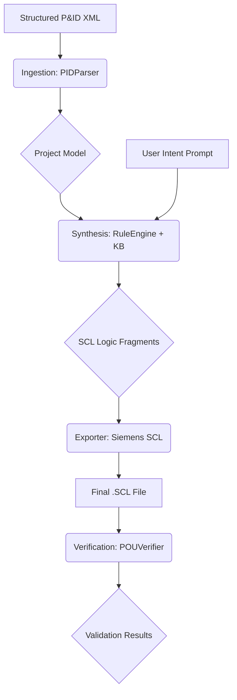

# Industrial AI System: Autonomous SCL Generation & Verification


## Overview

The **Industrial AI System** is an advanced framework designed to bridge the gap between process design and PLC implementation. It automates the generation of **Structured Control Language (SCL)** code from high-level engineering specifications, ensuring compliance with the international standard **IEC 61131-3**.

## Core Architecture

The system follows a modular "Model-to-Text" transformation pipeline:

1.  **Ingestion Layer (`PIDParser`)**: Parses structured industrial data (P&ID diagrams, XML/JSON lists) into a standardized internal `PIDModel`.
2.  **Synthesis Engine (`RuleEngine`)**: Applies engineering rules from a built-in knowledge base (interlocks, alarms, sequences) combined with user-defined intent to synthesize logic fragments.
3.  **Exporter Layer (`SiemensExporter`)**: Formats the synthesized logic into valid SCL code, ready to be imported into **Siemens TIA Portal**.
4.  **Verification Layer (`POUVerifier`)**: Performs automated POU (Program Organization Unit) validation using assertion-based logic to ensure safety and consistency.

## Process Flow



## Getting Started

### Prerequisites
- Python 3.8+
- Flask

### Installation
```bash
git clone https://github.com/NaikoRoig/Industrial_AI_sistems.git
cd Industrial_AI_sistems
pip install -r requirements.txt
```

### Running the System
```bash
python app.py
```
Access the professional interactive console at `http://localhost:5000`.

## Example SCL Output
```scl
FUNCTION_BLOCK FB_MainProject
VAR_INPUT
  PUMP01_FLT : BOOL;
END_VAR
VAR_OUTPUT
  PUMP01_RUN : BOOL;
END_VAR
BEGIN
  IF PUMP01_FLT THEN PUMP01_RUN := FALSE; END_IF;
END_FUNCTION_BLOCK
```

## Contributing
Contributions for other PLC platforms (Rockwell, PLCopen) or improved synthesis rules are welcome.

---
*Created by [Naiko Roig](https://github.com/NaikoRoig)*
